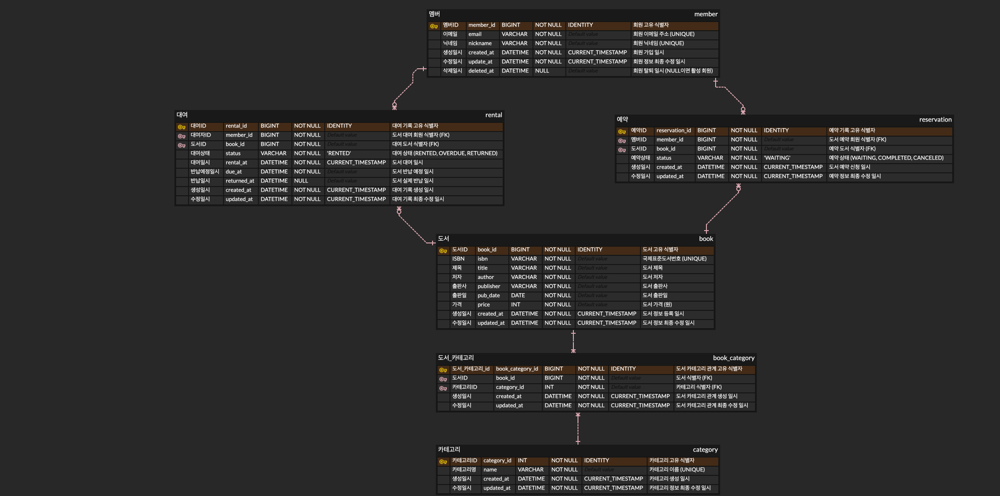

# 도서 대여 관리 시스템

> PostgreSQL 기반 관계형 데이터베이스 설계 및 SQL 실습 프로젝트

도서 대여 관리 시스템을 주제로 관계형 데이터베이스를 설계하고, SQL을 활용해 데이터를 저장하고 조회하는 프로젝트입니다.

백엔드 프레임워크 없이 PostgreSQL만을 사용하여 데이터 모델링부터 테이블 생성, 샘플 데이터 입력, 조회 및 집계, 데이터 수정과 삭제, 인덱스 생성까지 데이터베이스의 전반적인 흐름을 구현했습니다.

## 1. 프로젝트 개요

### 프로젝트 목표

- 도서 대여 서비스를 위한 관계형 데이터베이스 설계
- PK, FK 및 제약조건을 활용한 데이터 무결성 보장
- 1:N 및 N:M 관계를 고려한 테이블 구조 설계
- SQL을 활용한 데이터 조회, 검색, 정렬 및 집계
- JOIN과 서브쿼리를 활용한 테이블 간 데이터 조회
- UPDATE와 DELETE를 활용한 데이터 변경
- 인덱스 생성 및 실행 계획 분석

### 개발 환경

| 구분 | 기술 |
|---|---|
| Database | PostgreSQL 15 |
| Docker Image | pgvector/pgvector:0.8.0-pg15 |
| Container | Docker Compose |
| Database Client | DataGrip |
| Query Language | SQL |
| OS | macOS |

pgvector 확장이 포함된 PostgreSQL 이미지를 사용하지만, 본 프로젝트에서는 일반적인 관계형 데이터베이스 기능만 활용합니다.

---

## 2. 프로젝트 구조

```text
mariner-codyssey-week-6/
├── .env.example
├── .gitignore
├── compose.yaml
├── README.md
│
├── images/
│   └── book_erd.png
│
├── sql/
│   ├── 01_schema.sql
│   ├── 02_seed.sql
│   └── 03_queries.sql
│
└── results/
    ├── 01_book_title_search.txt
    ├── 02_book_price_filter.txt
    ├── 03_latest_books.txt
    ├── 04_expensive_books.txt
    ├── 05_member_rental_history.txt
    ├── 06_active_rentals.txt
    ├── 07_book_categories.txt
    ├── 08_all_member_rentals.txt
    ├── 09_member_rental_count.txt
    ├── 10_popular_books.txt
    ├── 11_category_avg_price.txt
    ├── 12_members_without_rentals.txt
    ├── 13_update_overdue_rentals.txt
    ├── 14_delete_canceled_reservations.txt
    ├── 15_index_before.txt
    └── 15_index_after.txt
```

### 주요 파일

| 파일 | 설명 |
|---|---|
| `compose.yaml` | PostgreSQL Docker Compose 환경 설정 |
| `01_schema.sql` | 테이블 및 제약조건 생성 |
| `02_seed.sql` | 샘플 데이터 입력 |
| `03_queries.sql` | 핵심 SQL 15개 |
| `book_erd.png` | 데이터베이스 ERD |
| `results/` | SQL 실행 결과 및 실행 계획 |

---

## 3. 데이터베이스 설계

### ERD



### 테이블 구성

총 6개의 테이블을 설계했습니다.

| 테이블 | 설명 | 주요 컬럼 |
|---|---|---|
| `member` | 회원 정보 관리 | member_id, email, nickname |
| `book` | 도서 정보 관리 | book_id, isbn, title, price |
| `category` | 도서 카테고리 관리 | category_id, name |
| `book_category` | 도서와 카테고리 관계 관리 | book_id, category_id |
| `rental` | 도서 대여 및 반납 기록 관리 | member_id, book_id, status |
| `reservation` | 도서 예약 기록 관리 | member_id, book_id, status |

### 테이블 관계

| 부모 테이블 | 자식 테이블 | 관계 |
|---|---|---|
| member | rental | 1:N |
| member | reservation | 1:N |
| book | rental | 1:N |
| book | reservation | 1:N |
| book | book_category | 1:N |
| category | book_category | 1:N |

도서와 카테고리는 N:M 관계이므로 `book_category` 중간 테이블을 사용했습니다.

하나의 도서는 여러 카테고리에 속할 수 있으며, 하나의 카테고리에도 여러 도서가 포함될 수 있습니다.

### 데이터 무결성

데이터의 일관성과 무결성을 유지하기 위해 다음 제약조건을 적용했습니다.

| 제약조건 | 적용 내용 |
|---|---|
| PRIMARY KEY | 모든 테이블의 고유 식별자 |
| FOREIGN KEY | 테이블 간 참조 무결성 보장 |
| NOT NULL | 필수 데이터 누락 방지 |
| UNIQUE | 이메일, ISBN, 카테고리 이름 등의 중복 방지 |
| CHECK | 도서 가격, 대여 상태, 예약 상태 등의 유효성 검증 |
| DEFAULT | 초기 상태 및 생성 일시 자동 설정 |

#### 주요 제약조건

**도서 가격**

```sql
CHECK (price >= 0)
```

음수 가격이 저장되지 않도록 제한했습니다.

**도서 대여 상태**

```sql
CHECK (status IN ('RENTED', 'OVERDUE', 'RETURNED'))
```

대여 상태를 대여 중, 연체, 반납 완료로 구분했습니다.

**도서 예약 상태**

```sql
CHECK (status IN ('WAITING', 'CANCELED', 'COMPLETED'))
```

예약 상태를 대기, 취소, 완료로 구분했습니다.

**도서 카테고리 관계**

```sql
UNIQUE (book_id, category_id)
```

동일한 도서와 카테고리의 중복 연결을 방지했습니다.

---

## 4. 실행 환경 구성

### 4.1. 환경 변수 설정

`.env.example` 파일을 복사하여 `.env` 파일을 생성합니다.

```bash
cp .env.example .env
```

`.env` 파일에 PostgreSQL 비밀번호를 설정합니다.

```dotenv
POSTGRES_PASSWORD=your_password
```

`.env` 파일은 Git 추적 대상에서 제외합니다.

### 4.2. PostgreSQL 실행

Docker Compose를 이용해 PostgreSQL 컨테이너를 실행합니다.

```bash
docker compose up -d
```

컨테이너 실행 상태를 확인합니다.

```bash
docker compose ps
```

정상적으로 실행됐다면 `book-rental-postgres` 컨테이너가 `healthy` 상태로 표시됩니다.

### 4.3. DataGrip 연결

DataGrip에서 PostgreSQL 데이터 소스를 생성하고 다음 정보를 입력합니다.

| 항목 | 값 |
|---|---|
| Host | localhost |
| Port | 5433 |
| Database | book_rental_db |
| User | book_user |
| Password | .env에 설정한 비밀번호 |
| Schema | public |

연결 후 다음 SQL로 데이터베이스 정보를 확인할 수 있습니다.

```sql
SELECT
    current_database() AS database_name,
    current_schema() AS schema_name,
    current_user AS username,
    version() AS postgres_version;
```

### 4.4. 데이터베이스 초기화

다음 순서로 SQL 파일을 실행합니다.

**1. 스키마 생성**

```text
sql/01_schema.sql
```

6개의 테이블과 PK, FK, UNIQUE, CHECK 등의 제약조건을 생성합니다.

**2. 샘플 데이터 입력**

```text
sql/02_seed.sql
```

각 테이블에 샘플 데이터를 입력하고 테이블 간 관계를 구성합니다.

**3. 핵심 SQL 실행**

```text
sql/03_queries.sql
```

각 SQL을 순서대로 개별 실행하고 결과를 확인합니다.

`UPDATE`와 `DELETE`는 실제 데이터를 변경하므로 트랜잭션을 활용해 실행 결과를 검증한 뒤 `ROLLBACK`으로 복구합니다.

`CREATE INDEX`는 인덱스 적용 전 실행 계획을 먼저 확인한 후 실행합니다.

---

## 5. 샘플 데이터

SQL 조회 및 집계 기능을 검증하기 위해 총 87개의 샘플 데이터를 구성했습니다.

| 테이블 | 데이터 수 |
|---|---:|
| member | 12 |
| book | 15 |
| category | 10 |
| book_category | 20 |
| rental | 18 |
| reservation | 12 |
| **합계** | **87** |

### 데이터 구성

단순히 행의 개수를 충족하는 것이 아니라 다양한 SQL 요구사항을 검증할 수 있도록 데이터를 구성했습니다.

- 대여 이력이 있는 회원과 없는 회원
- 활성 회원과 탈퇴 회원
- 대여 중인 도서와 연체 중인 도서
- 반납이 완료된 도서
- 대여 이력이 없는 도서
- 예약 대기, 취소 및 완료 기록
- 여러 카테고리에 속하는 도서
- 기간별 대여 기록

### 데이터 검증

```sql
SELECT 'member' AS table_name, COUNT(*) AS total FROM member
UNION ALL
SELECT 'book', COUNT(*) FROM book
UNION ALL
SELECT 'category', COUNT(*) FROM category
UNION ALL
SELECT 'book_category', COUNT(*) FROM book_category
UNION ALL
SELECT 'rental', COUNT(*) FROM rental
UNION ALL
SELECT 'reservation', COUNT(*) FROM reservation;
```

각 테이블의 데이터 수가 예상한 값과 일치하는지 확인합니다.

---

## 6. 핵심 SQL 구현

총 15개의 SQL을 작성하고 DataGrip을 통해 실행 결과를 확인합니다.

### 6.1. 기본 조회

| 번호 | 요구사항 | 주요 SQL |
|---|---|---|
| 01 | 도서 제목 검색 | SELECT, WHERE, ILIKE |
| 02 | 특정 가격 이상의 도서 조회 | WHERE, ORDER BY |
| 03 | 최근 출판된 도서 TOP 5 | ORDER BY, LIMIT |
| 04 | 가격이 높은 도서 TOP 5 | ORDER BY, LIMIT |

조건에 맞는 데이터를 조회하고 검색 및 정렬하는 방법을 구현했습니다.

### 6.2. JOIN

| 번호 | 요구사항 | 주요 SQL |
|---|---|---|
| 05 | 회원별 도서 대여 내역 | INNER JOIN |
| 06 | 현재 대여 중인 도서 및 회원 | INNER JOIN, WHERE |
| 07 | 도서별 카테고리 목록 | INNER JOIN |
| 08 | 대여 이력이 없는 회원 포함 조회 | LEFT JOIN |

FK로 연결된 테이블을 JOIN하여 필요한 데이터를 조회했습니다.

특히 도서와 카테고리의 N:M 관계를 `book_category` 중간 테이블을 통해 조회했습니다.

### 6.3. 집계

| 번호 | 요구사항 | 주요 SQL |
|---|---|---|
| 09 | 회원별 총 대여 횟수 | COUNT, GROUP BY |
| 10 | 인기 도서 TOP 5 | COUNT, GROUP BY, LIMIT |
| 11 | 카테고리별 평균 도서 가격 | SUM, AVG, GROUP BY |

집계 함수를 활용해 회원과 도서 및 카테고리에 대한 통계 정보를 조회했습니다.

대여 이력이 없는 회원도 집계하기 위해 LEFT JOIN과 COUNT의 NULL 처리 특성을 활용했습니다.

### 6.4. 서브쿼리

| 번호 | 요구사항 | 주요 SQL |
|---|---|---|
| 12 | 대여 이력이 없는 회원 조회 | NOT EXISTS |

상관 서브쿼리를 사용해 대여 기록의 존재 여부를 확인했습니다.

### 6.5. 데이터 수정 및 삭제

| 번호 | 요구사항 | 주요 SQL |
|---|---|---|
| 13 | 연체된 대여 상태 변경 | UPDATE, WHERE, RETURNING |
| 14 | 취소된 예약 기록 삭제 | DELETE, WHERE, RETURNING |

PostgreSQL의 RETURNING을 활용해 변경된 데이터를 확인했습니다.

또한 트랜잭션을 사용하여 수정 및 삭제 결과를 확인한 뒤 ROLLBACK으로 원본 데이터를 복구하도록 구성했습니다.

### 6.6. 인덱스

| 번호 | 요구사항 | 주요 SQL |
|---|---|---|
| 15 | 회원별 최근 대여 내역 조회 인덱스 | CREATE INDEX |

대여 기록의 회원별 검색과 최신순 정렬을 지원하기 위해 복합 인덱스를 생성했습니다.

```sql
CREATE INDEX IF NOT EXISTS idx_rental_member_rental_at
    ON rental (member_id, rental_at DESC);
```

---

## 7. 인덱스 실행 계획 분석

### 인덱스 설계

특정 회원의 대여 내역을 최신순으로 조회하는 SQL을 대상으로 복합 인덱스를 설계했습니다.

```sql
SELECT
    r.rental_id,
    r.member_id,
    r.book_id,
    r.status,
    r.rental_at
FROM rental r
WHERE r.member_id = (
    SELECT m.member_id
    FROM member m
    WHERE m.email = 'minji@example.com'
)
ORDER BY r.rental_at DESC;
```

검색 조건인 `member_id`와 정렬 조건인 `rental_at DESC`를 결합했습니다.

### 실행 계획 비교

PostgreSQL의 `EXPLAIN (ANALYZE, BUFFERS)`를 활용해 인덱스 적용 전후 실행 계획을 비교했습니다.

| 항목 | 인덱스 적용 전 | 인덱스 적용 후 |
|---|---|---|
| 검색 방식 | Seq Scan | Seq Scan |
| 정렬 방식 | Sort | Sort |
| 조회 결과 | 3행 | 3행 |
| Planning Time | 0.233ms | 0.459ms |
| Execution Time | 0.065ms | 0.126ms |

### 분석 결과

인덱스 적용 전후 모두 PostgreSQL은 Seq Scan을 선택했습니다.

이는 `rental` 테이블에 18개의 데이터만 존재하므로, 인덱스를 탐색하는 것보다 테이블 전체를 읽는 비용이 낮다고 판단한 것으로 분석했습니다.

실행 시간은 0.065ms에서 0.126ms로 측정됐지만, 데이터 규모가 작고 실행 환경에 따른 편차가 존재하므로 이를 인덱스의 성능 저하로 판단할 수는 없습니다.

**인덱스가 생성되어 있더라도 PostgreSQL은 데이터 규모와 예상 실행 비용을 고려하여 실행 계획을 선택한다는 점을 확인했습니다.**

인덱스 적용 전후 실행 계획은 `results/` 디렉터리에 저장합니다.

---

## 8. SQL 실행 결과

각 SQL의 실행 결과를 DataGrip에서 확인하고 TXT 형식으로 저장합니다.

| 분류 | 결과 파일 |
|---|---|
| 기본 조회 | 01 ~ 04 |
| JOIN | 05 ~ 08 |
| 집계 | 09 ~ 11 |
| 서브쿼리 | 12 |
| UPDATE / DELETE | 13 ~ 14 |
| 인덱스 실행 계획 | 15_index_before / 15_index_after |

모든 조회 SQL은 샘플 데이터 기준으로 실행 결과를 확인할 수 있습니다.

데이터 수정 및 삭제 쿼리는 RETURNING으로 변경된 행을 확인하고, ROLLBACK을 통해 기존 데이터를 유지합니다.

---

## 9. 주요 학습 내용

### 관계형 데이터 모델링

서비스의 데이터를 역할에 따라 테이블로 분리하고 PK와 FK를 통해 관계를 표현하는 방법을 학습했습니다.

특히 1:N 관계와 N:M 관계의 차이를 이해하고 중간 테이블을 활용해 다대다 관계를 구현했습니다.

### 데이터 무결성

NOT NULL, UNIQUE, CHECK, FOREIGN KEY 제약조건을 적용하여 잘못된 데이터가 저장되지 않도록 구성했습니다.

데이터의 유효성을 애플리케이션에만 의존하지 않고 데이터베이스 수준에서도 보장할 수 있음을 학습했습니다.

### JOIN과 서브쿼리

INNER JOIN과 LEFT JOIN을 활용해 여러 테이블의 데이터를 연결하고, NOT EXISTS를 통해 특정 데이터의 존재 여부를 검사하는 방법을 학습했습니다.

### 집계와 통계

COUNT, SUM, AVG, GROUP BY를 활용하여 데이터를 집계하고 대여 횟수 및 평균 가격과 같은 통계 정보를 추출했습니다.

### 트랜잭션

BEGIN과 ROLLBACK을 활용해 데이터 수정 및 삭제 결과를 검증하고, 변경 사항을 취소해 기존 데이터를 복구하는 방법을 학습했습니다.

### 인덱스와 실행 계획

B-Tree 복합 인덱스를 생성하고 EXPLAIN ANALYZE로 실행 계획을 분석했습니다.

인덱스가 존재하더라도 데이터 규모와 실행 비용에 따라 Seq Scan이 선택될 수 있음을 확인했습니다.

---

## 10. 프로젝트 정리

이번 프로젝트에서는 도서 대여 서비스를 위한 관계형 데이터베이스를 설계하고, SQL만을 활용해 데이터 저장부터 조회 및 분석까지 구현했습니다.

ERD를 기반으로 총 6개의 테이블을 구성하고 PK, FK 및 다양한 제약조건을 적용하여 데이터의 관계와 무결성을 관리했습니다.

또한 87개의 샘플 데이터를 바탕으로 조회, JOIN, 집계, 서브쿼리, 수정 및 삭제 등 15개의 핵심 SQL을 작성했습니다.

마지막으로 복합 인덱스를 생성하고 실행 계획을 비교하며 PostgreSQL의 쿼리 최적화 방식을 학습했습니다.

이를 통해 ORM을 사용하기 전에 관계형 데이터베이스의 구조와 SQL의 동작 원리를 이해하는 기반을 마련했습니다.